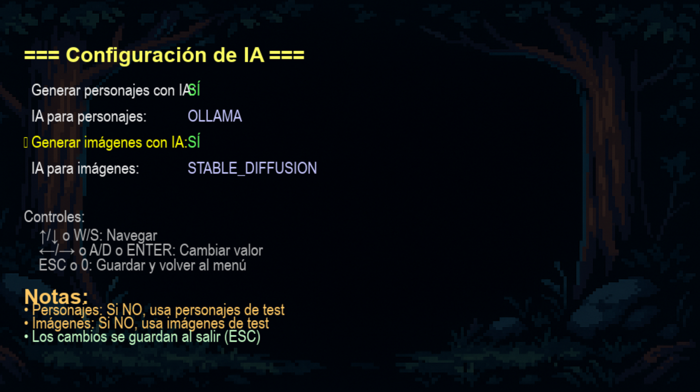
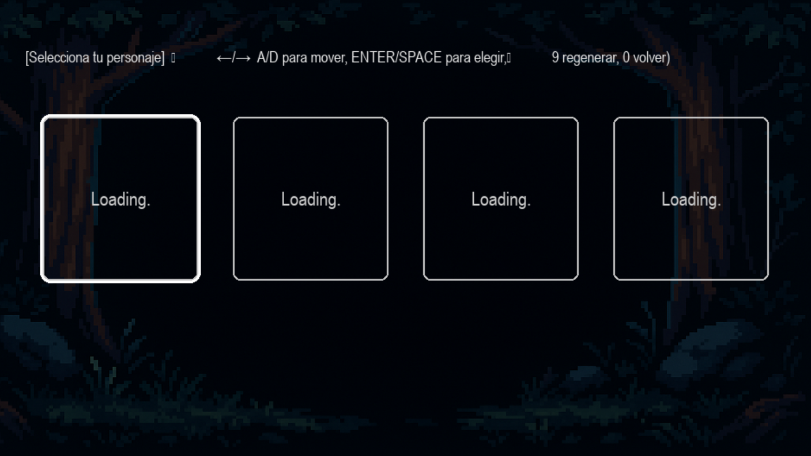
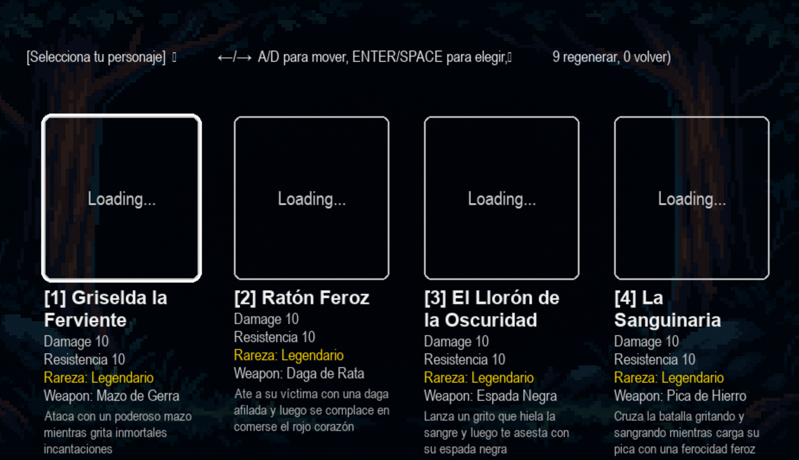
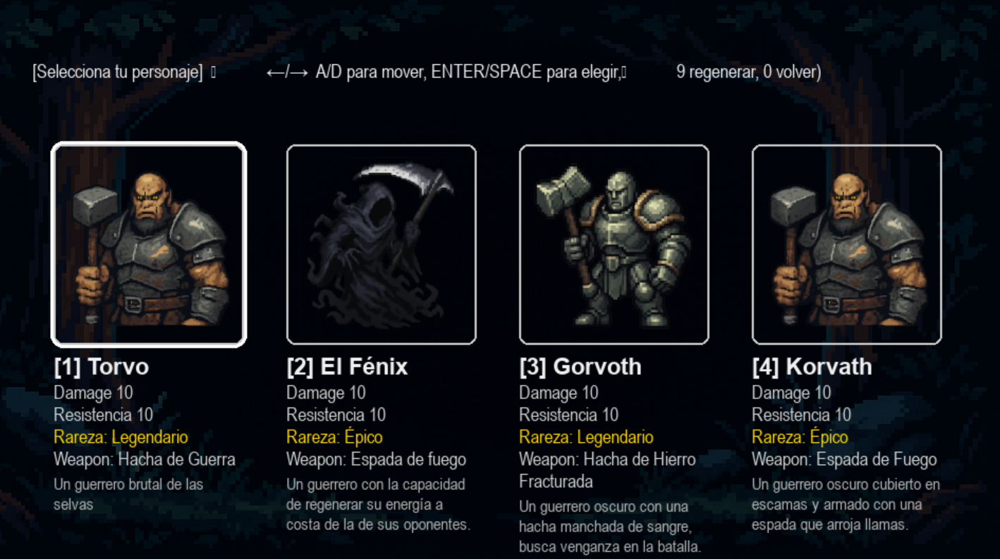
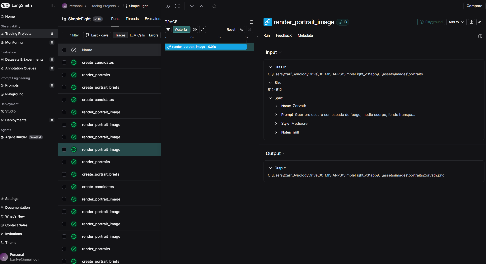

# 🎮 AgentFight - Documentación Completa

## 📋 **Índice**
1. [Funcionalidades Principales](#funcionalidades-principales)
2. [Sistema de IA](#sistema-de-ia)
3. [Configuración](#configuración)
4. [Generación de Contenido](#generación-de-contenido)

---

## 🚀 **Funcionalidades Principales**

AgentFight es un juego de combate 2D con generación de contenido mediante IA. 
El juego incluye:

- ✅ **Sistema de combate** con físicas y controles 
- ✅ **Generación de personajes** con IA (Ollama/OpenAI)
- ✅ **Generación de imágenes** con Stable Diffusion SDXL Turbo o con openai
- ✅ **Narrativa personalizada** generada por IA
- ✅ **Pantalla de configuración** para ajustar opciones de IA
- ✅ **Trazabilidad completa** con LangSmith
- ✅ **Sistema de fallback** automático a assets de test

### **Controles del Juego:**
- **WASD** o **Flechas**: Movimiento
- **SPACE**: Atacar
- **R**: Reset ronda
- **N**: Nueva lucha
- **ESC**: Volver al menú

### **Tipos de Sprite Disponibles:**
1. **idle** - Sprite de reposo
2. **walk** - Sprite de caminata
3. **attack** - Sprite de ataque
4. **block** - Sprite de bloqueo
5. **hurt** - Sprite de daño
6. **jump** - Sprite de salto
7. **death** - Sprite de muerte

nota: actualmente me encuentro trabajando en la generación de personajes ajustando Stable Diffusion para generar contenido de la misma calidad que genera openai pero de manera gratuita. El siguiente paso será la generación de sprites y continuar con el desarrollo de la pantalla de lucha que actualmente usa un Sprite de fallback 
---

## 🤖 **Sistema de IA**

### **Arquitectura de Proveedores de IA**
El juego soporta múltiples proveedores de IA mediante un sistema modular:

- **Ollama** (Local) - Modelo por defecto: `llama3.1:8b`
- **OpenAI** - Modelos: `gpt-4o-mini`, `gpt-4`, etc.

### **Generación de Contenido con IA**
- ✅ **Personajes**: Generación automática con IA (Ollama/OpenAI)
- ✅ **Imágenes**: Generación de retratos con Stable Diffusion SDXL Turbo
- ✅ **Historia**: Narrativa personalizada generada por IA
- ✅ **Fondos**: Generación automática de fondos de combate

### **Pantalla de Configuración de IA** 🆕
pantalla accesible desde el menú principal (`[4] Settings`) que permite configurar:

1. **Generar personajes con IA** (Sí/No)
   - Si NO: Usa personajes de test locales
   - Si SÍ: Genera personajes únicos con IA

2. **IA para personajes** (Ollama/OpenAI)
   - Selecciona qué proveedor usar para generar personajes

3. **Generar imágenes con IA** (Sí/No)
   - Si NO: Usa imágenes de test locales
   - Si SÍ: Genera imágenes con Stable Diffusion

4. **IA para imágenes** (Stable Diffusion/OpenAI DALL-E)
   - Selecciona qué proveedor usar para generar imágenes

**Pantalla de Configuración:**


*Interfaz de la pantalla de configuración donde se pueden ajustar las opciones de generación con IA*

**Controles en Settings:**
- `↑/↓` o `W/S`: Navegar entre opciones
- `←/→` o `A/D` o `ENTER`: Cambiar valor
- `ESC` o `0`: Guardar y volver al menú

---

## 🎨 **Generación de Contenido**

### **Generación de Imágenes**
- **Modelo**: `stabilityai/sdxl-turbo` (25.85 GB, ya descargado)
- **Optimizado para Pixel Art**: Prompts específicos para estilo retro
- **Tamaños**: 512x512 para retratos, 256x256 para sprites
- **Parámetros optimizados**: 8 steps, guidance_scale 2.0

### **Prompts Optimizados**
- ✅ **Pixel art específico**: "8-bit pixel art, retro game sprite"
- ✅ **Límite de tokens**: Prompts optimizados para CLIP (77 tokens)
- ✅ **Negative prompts**: Evita estilos realistas y sombras suaves

---

## 🎭 **Opciones de Creación de Personajes**

### **Modo 1: Generación con IA** (Recomendado)
Cuando `use_local_characters_for_test = false` y `use_existing_assets = false`:

1. **Character Creator Agent** → Genera 4 personajes únicos con:
   - Nombre, daño, resistencia, arma, descripción
   - Deduplicación automática (sin nombres repetidos)
   - Relleno inteligente si faltan personajes

2. **Art Director Agent** → Crea briefs visuales para cada personaje:
   - Prompt breve (máximo 60 palabras)
   - Estilo consistente pixel art 2D
   - Descripción de pose, arma visible

3. **Image Renderer** → Genera retratos con Stable Diffusion:
   - Modelo: SDXL Turbo
   - Estilo: Pixel art 8-bit optimizado
   - Tamaño: 512x512
   - Fondo transparente

**Proceso de Creación de Personajes:**


*Flujo completo de generación de personajes: desde la creación de candidatos hasta la generación de imágenes*

**Proceso en Dos Etapas - Separación de IAs:**


*Ilustración del proceso de generación en dos etapas:*
- **Etapa 1 (IA de Texto)**: Los campos de datos del personaje (nombre, daño, resistencia, arma, descripción) ya están generados por una IA de lenguaje (Ollama/OpenAI). Estos datos aparecen inmediatamente en la pantalla de selección.
- **Etapa 2 (IA de Imágenes)**: Las imágenes de retrato todavía están en proceso de generación ("Loading...") por otra IA especializada en imágenes (Stable Diffusion/OpenAI DALL-E). Este proceso es más lento y ocurre en paralelo mientras el jugador puede ver los datos del personaje.

*Este diseño permite que el jugador vea la información del personaje mientras las imágenes se generan en segundo plano, mejorando la experiencia de usuario.*

### **Generación de Imágenes - Comparativa de Proveedores**

El juego soporta dos proveedores para generar imágenes de retratos:

#### **Stable Diffusion (Local)**
- **Modelo**: `stabilityai/sdxl-turbo` (25.85 GB)
- **Tiempo de generación**: ~15-30 segundos por imagen (depende del hardware)
- **Costo**: Gratis (local, requiere GPU recomendada)
- **Calidad**: Buena para pixel art, requiere optimización de prompts
- **Parámetros optimizados**: 8 steps, guidance_scale 2.0

**Ventajas:**
- ✅ Gratis, sin costos por imagen
- ✅ Totalmente local, sin dependencias externas
- ✅ Bueno para desarrollo y testing

**Desventajas:**
- ⚠️ Requiere GPU potente para tiempos razonables
- ⚠️ Prompts deben estar muy optimizados para pixel art
- ⚠️ Calidad bastante mala y sin homogeneidad

#### **OpenAI DALL-E (Cloud)**
- **Modelo**: DALL-E 3
- **Tiempo de generación**: ~5-10 segundos por imagen
- **Costo**: De pago (según plan de API)
- **Calidad**: Superior, mejor comprensión de prompts y estilo pixel art

**Ventajas:**
- ✅ Calidad consistente y superior
- ✅ Mejor comprensión de prompts complejos
- ✅ Más rápido que Stable Diffusion local
- ✅ No requiere GPU local

**Desventajas:**
- ⚠️ Requiere API key y tiene costos por imagen
- ⚠️ Depende de conexión a internet

### **Ejemplos de Imágenes Generadas**

En la carpeta `app/UI/assets/images/portraits/` puedes encontrar ejemplos de retratos generados:
- **Con OpenAI DALL-E**: Imágenes de alta calidad con mejor comprensión del estilo pixel art
- **Con Stable Diffusion**: Imágenes generadas localmente con SDXL Turbo

Estos archivos PNG sirven como referencia para comparar la calidad y estilo de ambos proveedores.

**Ventajas del Modo 1:**
- ✅ Personajes únicos y variados
- ✅ Imágenes generadas específicamente para cada personaje
- ✅ Experiencia personalizada cada partida

### **Modo 2: Personajes de Test** (Fallback)
Cuando `use_local_characters_for_test = true` o `use_existing_assets = true`:

1. **Personajes locales**: Usa `_fake_candidates()` con nombres aleatorios
2. **Imágenes de test**: Usa imágenes pregeneradas en `app/UI/assets/test/portraits/`

**Ejemplo de imágenes disponibles en modo fallback:**


*Algunas de las imágenes de test que se usan cuando no se genera con IA*

**Ventajas:**
- ✅ Más rápido (sin generación)
- ✅ Sin dependencias de IA
- ✅ Útil para testing y desarrollo

### **Configuración de Proveedor de IA**
- **Ollama** (Local): Modelo `llama3.1:8b` - Gratis, rápido, local
- **OpenAI**: Modelos `gpt-4o-mini` o `gpt-4` - Requiere API key y genera coste monetario.

---

## 📖 **Generación de Historia**

El sistema de narrativa genera historias personalizadas basadas en el personaje elegido y los resultados de combate.

### **Tipos de Narrativa Generada:**

1. **Introducción** (`create_introduction_story`)
   - Personalizada según el personaje elegido
   - Incluye: título, introducción, conflicto, escenario
   - Se genera cuando el jugador selecciona personaje

2. **Narrativa de Combate** (`create_combat_narrative`)
   - Generada después de cada combate
   - Incluye: setup, acción, climax, resultado
   - Adaptada al resultado (victoria/derrota)

3. **Desenlace** (`create_ending_story`)
   - Generada al final de la partida
   - Incluye: epílogo, conclusión, moraleja
   - Basada en el rendimiento del jugador

4. **Story Beats** (`create_story_beat`)
   - Eventos narrativos específicos
   - Generados dinámicamente según contexto

### **Características:**
- ✅ **Personalización**: Adaptada al personaje del jugador
- ✅ **Coherencia**: Mantiene contexto entre combates
- ✅ **Temperatura alta** (0.8): Narrativa creativa y variada
- ✅ **Traducida**: Todo en español

---

## 🤖 **Sistema de Agentes**

El juego utiliza un sistema modular de agentes especializados, cada uno con una función específica en el pipeline de generación de contenido.

### **Agentes Disponibles:**

#### **1. Character Creator Agent** 🎭
**Archivo:** `app/Agent/agent_character_creator.py`

**Función:** Genera personajes jugables con estadísticas balanceadas.

**Métodos:**
- `create_character()`: Crea un personaje individual
- `create_candidates(n)`: Crea n personajes en lote

**Características:**
- Deduplicación automática de nombres
- Estadísticas balanceadas (damage 1-10, resistencia 1-10)
- Relleno inteligente si faltan personajes
- Temperature: 0.7 (variedad moderada)

**Output:**
```python
Character(
    name: str,
    damage: int (1-10),
    resistence: int (1-10),
    weapon: str,
    description: str
)
```

#### **2. Art Director Agent** 🎨
**Archivo:** `app/Agent/agent_art_director.py`

**Función:** Crea briefs visuales para generar imágenes de retratos.

**Métodos:**
- `create_portrait_briefs(characters)`: Crea briefs para múltiples personajes

**Características:**
- Briefs muy breves (máximo 60 palabras)
- Estilo consistente pixel art 2D
- Optimizado para Stable Diffusion
- Temperature: 0.6 (coherente pero creativo)

**Output:**
```python
PortraitSpec(
    name: str,
    prompt: str,  # Descripción visual
    style: str,   # Estilo artístico
    notes: str    # Notas opcionales
)
```

#### **3. Story Weaver Agent** 📖
**Archivo:** `app/Agent/agent_story_weaver.py`

**Función:** Genera narrativa personalizada para el juego.

**Métodos:**
- `create_introduction_story(player)`: Introducción de la partida
- `create_combat_narrative(player, enemy, result)`: Narrativa de combate
- `create_ending_story(player, performance)`: Desenlace final
- `create_story_beat(event_type, player, context)`: Eventos narrativos

**Características:**
- Narrativa adaptada al personaje
- Mantiene coherencia entre eventos
- Temperature: 0.8 (muy creativo)
- Todo en español

**Output:**
```python
{
    "title": str,
    "introduction": str,
    "conflict": str,
    "setting": str
}
```

#### **4. Background Director Agent** 🖼️
**Archivo:** `app/Agent/agent_background_director.py`

**Función:** Crea briefs para generar fondos de combate.

**Métodos:**
- `create_background_brief(story_context, player, enemy)`: Fondo general
- `create_combat_background(player, enemy, context)`: Fondo de combate
- `create_story_background(story_context)`: Fondo narrativo

**Características:**
- Fondos adaptados al contexto del combate
- Estilo pixel art épico
- Sin personajes en el fondo

#### **5. Sprite Director Agent** 🎬
**Archivo:** `app/Agent/agent_sprite_director.py`

**Función:** Crea briefs para generar sprites de personajes.

**Métodos:**
- `create_character_sprite_brief(character)`: Brief para sprite de personaje
- `create_animation_brief(character, animation_type)`: Brief para animación
- `create_character_sprite_set(character)`: Set completo de sprites

**Características:**
- Especificaciones detalladas de estilo
- Integración de armas
- Estilos de animación

#### **6. Sprite Generator Agent** 🎨
**Archivo:** `app/Agent/agent_sprite_generator.py`

<< En proceso >>

**Función:** Genera sprites usando IA (actualmente no activo por defecto).

**Métodos:**
- `create_sprite_specification(character, sprite_type)`: Especificación
- `generate_sprite_image(spec, output_dir)`: Genera imagen

#### **7. Image Renderer** 🖼️
**Archivo:** `app/Agent/image_renderer.py`

**Función:** Renderiza imágenes usando los proveedores configurados.

**Métodos:**
- `render_portraits(briefs)`: Genera retratos en paralelo
- `generate_background_image(brief)`: Genera fondo de combate

**Características:**
- Generación paralela (hasta 3 workers)
- Cache de imágenes
- Fallback automático si falla

---

### **Secuencias de Agentes (Flows)**

#### **Flow 1: Selección de Personajes** 🔄
```
1. Usuario entra a selección de personajes
   ↓
2. Character Creator Agent
   ├─ create_candidates(4)
   ├─ Genera 4 personajes únicos
   └─ Output: List[Character]
   ↓
3. Art Director Agent
   ├─ create_portrait_briefs(characters)
   ├─ Crea briefs visuales para cada personaje
   └─ Output: List[PortraitSpec]
   ↓
4. Image Renderer
   ├─ render_portraits(briefs)
   ├─ Genera imágenes en paralelo (max 3 workers)
   └─ Output: Dict[name: path]
   ↓
5. Asociación de imágenes a personajes
   └─ attach_portraits_to_characters()
```

**Tiempo estimado:** 30-60 segundos (depende de generación de imágenes)

#### **Flow 2: Inicio de Partida** 📖
```
1. Usuario selecciona personaje
   ↓
2. Orchestrator.set_player(character)
   ├─ Guarda contexto del jugador
   └─ Actualiza story_context
   ↓
3. Story Weaver Agent
   ├─ create_introduction_story(player)
   ├─ Genera introducción personalizada
   └─ Output: {title, introduction, conflict, setting}
   ↓
4. Background Director Agent
   ├─ create_combat_background(player, enemy)
   └─ Genera brief para fondo de combate
   ↓
5. Image Renderer
   ├─ generate_background_image(brief)
   └─ Genera fondo de combate
```

**Tiempo estimado:** 10-20 segundos

#### **Flow 3: Combate** ⚔️
```
1. Combate se completa
   ↓
2. Orchestrator.add_combat_result(result)
   ├─ Guarda resultado del combate
   └─ Actualiza story_context
   ↓
3. Story Weaver Agent
   ├─ create_combat_narrative(player, enemy, result)
   ├─ Genera narrativa del combate
   └─ Output: {setup, action, climax, outcome}
   ↓
4. Background Director Agent (si es nuevo combate)
   ├─ create_combat_background(player, new_enemy)
   └─ Genera nuevo fondo
```

**Tiempo estimado:** 5-15 segundos

#### **Flow 4: Fin de Partida** 🏁
```
1. Usuario completa la partida
   ↓
2. Orchestrator.get_player_performance()
   ├─ Calcula estadísticas
   └─ Output: {wins, losses, win_rate}
   ↓
3. Story Weaver Agent
   ├─ create_ending_story(player, performance)
   ├─ Genera desenlace personalizado
   └─ Output: {epilogue, conclusion, moral}
```

**Tiempo estimado:** 5-10 segundos

---

### **Trazabilidad con LangSmith** 📊

Todos los agentes están decorados con `@traceable` para seguimiento completo de todas las operaciones de IA.

**Funcionalidades de Observabilidad:**

1. **Waterfall View**: Visualización temporal de todas las operaciones
2. **Input/Output Tracking**: Ver exactamente qué datos entran y salen de cada agente
3. **Performance Metrics**: Tiempos de ejecución de cada llamada
4. **Error Tracking**: Captura automática de errores y excepciones
5. **Project Organization**: Todas las trazas agrupadas en el proyecto `SimpleFight_v3`

**Vista de Observabilidad:**



*Ejemplo de interfaz de LangSmith mostrando:*
- *Waterfall view con todas las operaciones rastreadas*
- *Detalles de `render_portrait_image` con inputs (prompt, tamaño, directorio) y outputs (ruta del archivo generado)*
- *Tiempo de ejecución de cada operación*
- *Lista completa de todas las llamadas a agentes (create_candidates, render_portraits, create_portrait_briefs, etc.)*

**Configuración en `.env`:**
```env
LANGCHAIN_TRACING_V2=true
LANGCHAIN_API_KEY=tu_api_key
LANGCHAIN_PROJECT=SimpleFight_v3
```

**Acceso:** https://smith.langchain.com → Proyecto `SimpleFight_v3`

---

## ⚙️ **Configuración**

### **Archivo `settings/settings.json`**
```json
{
  "AIProvider": {
    "provider": "ollama",
    "ollama": {
      "model": "llama3.1:8b",
      "temperature": 0.3,
      "num_predict": 500,
      "timeout": 240
    }
  },
  "ImageGeneration": {
    "provider": "stable_diffusion",
    "stable_diffusion_model": "stabilityai/sdxl-turbo",
    "stable_diffusion_steps": 8
  },
  "Debug": {
    "use_existing_assets": false,
    "use_local_characters_for_test": false
  }
}
```

### **Ubicación de Modelos**
- **Ollama**: Modelos locales ejecutándose en `http://localhost:11434`
- **Stable Diffusion**: Modelos en caché de Hugging Face:
  - `C:\Users\[usuario]\.cache\huggingface\hub\`
  - Modelo SDXL Turbo: ~25.85 GB

---

## ✅ **Sistema de Fallback**

Si la generación con IA falla o está desactivada, el juego usa automáticamente assets de test:

- ✅ **Personajes de test**: Usa `_fake_candidates()` con nombres aleatorios
- ✅ **Imágenes de test**: Usa imágenes pregeneradas en `app/UI/assets/test/portraits/`
- ✅ **El juego continúa funcionando** sin errores

**Ejemplo de imágenes por defecto disponibles:**


*Algunas de las imágenes de test que se usan cuando no se genera con IA*

---
 
## 🔧 **Instalación y Configuración:**

### **Requisitos:**
- Python 3.11+
- Pygame 2.6.1+
- Ollama corriendo localmente (para generación de personajes)
- Modelos de Hugging Face descargados (para generación de imágenes)

### **Instalación de Dependencias:**
```bash
uv venv
.venv\Scripts\activate  # Windows
uv pip install -r requirements.txt
```

### **Configuración de Ollama:**
1. Instalar Ollama desde https://ollama.ai
2. Descargar modelo: `ollama pull llama3.1:8b`
3. Asegurarse de que Ollama está corriendo en `http://localhost:11434`

### **Configuración de LangSmith (Opcional):**
1. Crear cuenta en https://smith.langchain.com
2. Obtener API key
3. Agregar al `.env`:
   ```env
   LANGCHAIN_TRACING_V2=true
   LANGCHAIN_API_KEY=tu_api_key
   LANGCHAIN_PROJECT=SimpleFight_v3
   ```

---

**¡Disfruta del juego con IA!** 🎮🎨🤖
